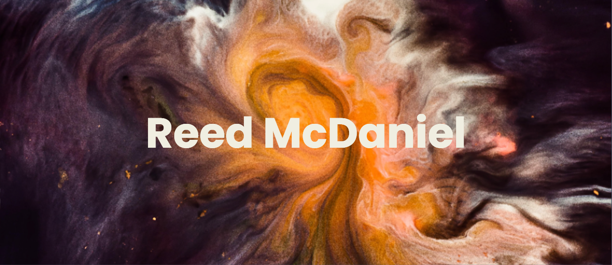

_photo by [Joel Filipe](https://unsplash.com/@joelfilip)_

---

# About Me
I am a software engineer working to combine my passions for health and tech
<!-- Focusing on building more inclusive communities around fitness, nutrition, and wellness -->
- 🔭 I’m currently working on: creating my first design system in Figma
- 🌱 I’m currently learning: full-stack development through Codecademy
<!--
  - 👯 I’m looking to collaborate on ...
  - 🤔 I’m looking for help with ...
  - 💬 Ask me about ...
-->
- 📫 How to reach me: Find me on [LinkedIn](https://www.linkedin.com/in/reed-mcdaniel)
- 🙂 Pronouns: they/them 🏳️‍🌈
- ⚡ Fun fact: I am a NASM certified personal trainer with 10+ years of boxing experience 🥊

---

## Portfolio Projects
- [Reed's Boxing Gym](https://cerulean-cactus-a5c733.netlify.app/): A mock static website for a boxing gym ([source code](https://github.com/reed-mcdaniel-716/first-chakra-ui-app))
- [Reed's Reads](https://elegant-melba-99379c.netlify.app/): A React app for finding books using the Google Books API ([source code](https://github.com/reed-mcdaniel-716/reeds-reads))
